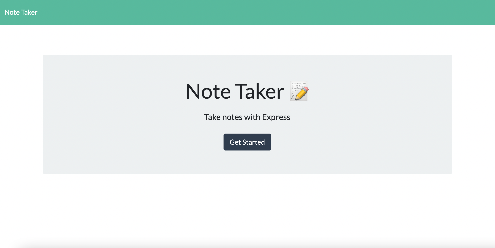
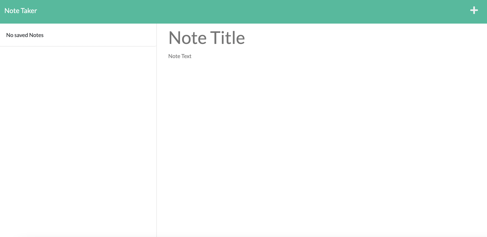
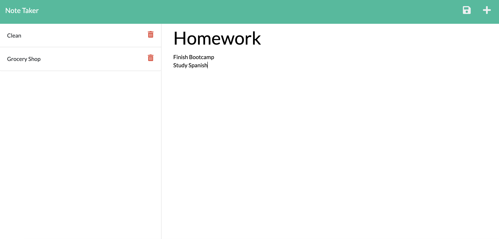

# Note Taker

  

  ## Description
  This note application allows a user to create, store, view, and delete notes easily. Most noted technologies used were Expres.js and Node.js to integrate the back end server routes and storage to the front end user interface.

  ## Table of Contents
  * [Installation](#installation)
  * [Usage](#usage)
  * [Credits](#credits)
  * [License](#license)
  * [Contact](#contact)

  ## Installation
  Clone repository. Run "npm i". Check the dependencies to make sure both "express" and "uuid" are listed. If not, run "npm i express" and "npm i uuid" respectively for routing and unique id creation.

  ## Usage
  Run the "server.js" file in the command line using "node server.js" and a prompt will appear with a link to the local host: http://localhost:3001. Follow the previous link in the command line or view the deployed version [here.](https://note-taker-1016.herokuapp.com/)

  
  
  

  View functionality [video.](https://watch.screencastify.com/v/a4k1qXti2yqYk03ieZyi)

  ## Credits
  Contributors to the project: Starter code provided by Georgia Institute of Technology

  ## License
  License for this project: [MIT License](https://choosealicense.com/licenses/mit/)

  ## Contact
  With any questions or concerns, please contact me via GitHub at [cianfich1016](https://github.com/cianfich1016) or by email at cianfich@gmail.com.

